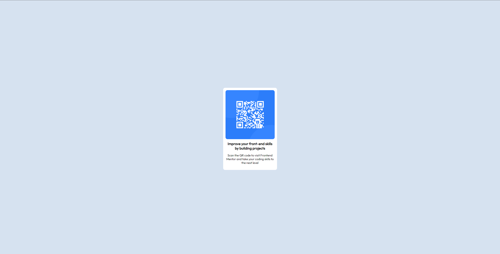

# Frontend Mentor - QR code component solution

This is a solution to the [QR code component challenge on Frontend Mentor](https://www.frontendmentor.io/challenges/qr-code-component-iux_sIO_H). Frontend Mentor challenges help you improve your coding skills by building realistic projects. 

## Table of contents

- [Overview](#overview)
  - [Screenshot](#screenshot)
  - [Links](#links)
- [My process](#my-process)
  - [Built with](#built-with)
  - [What I learned](#what-i-learned)
  - [Continued development](#continued-development)
  - [Useful resources](#useful-resources)
- [Author](#author)

## Overview

### Screenshot

### Links

- Live Site URL: https://smmoses.github.io/qr-code-exercise/

## My process

### Built with

- HTML5
- CSS
- Flexbox

### What I learned

I relearned how to center something vertically and horizontally using flexbox. I am hoping doing this exercise will reinforce that ability.

### Continued development

While researching, I found multiple ways to vertically and horizontally center. I am still not sure what is considered the best practice.

I did have some issue with the breakpoints. I elected to use a 425px breakpoint for my small screens. It looks kind of tacky at that point. It can be fixed with different breakpoints. 

### Useful resources

- [Complete Guide to Flexbox](https://css-tricks.com/snippets/css/a-guide-to-flexbox/) - This was a good refresher for using flexbox.

## Author

- Frontend Mentor - [@smmoses](https://www.frontendmentor.io/profile/yourusername)
